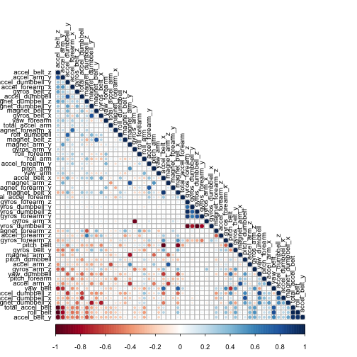

    
## Background

Using devices such as Jawbone Up, Nike FuelBand, and Fitbit it is now possible to collect a large amount of data about personal activity relatively inexpensively. These type of devices are part of the quantified self movement – a group of enthusiasts who take measurements about themselves regularly to improve their health, to find patterns in their behavior, or because they are tech geeks. One thing that people regularly do is quantify how much of a particular activity they do, but they rarely quantify how well they do it. In this project, your goal will be to use data from accelerometers on the belt, forearm, arm, and dumbell of 6 participants. They were asked to perform barbell lifts correctly and incorrectly in 5 different ways. More information is available from the website here: http://groupware.les.inf.puc-rio.br/har (see the section on the Weight Lifting Exercise Dataset). 

## Data 

The training data for this project are available here: 
    
    https://d396qusza40orc.cloudfront.net/predmachlearn/pml-training.csv

The test data are available here: 
    
    https://d396qusza40orc.cloudfront.net/predmachlearn/pml-testing.csv

The data for this project come from this source: http://groupware.les.inf.puc-rio.br/har. If you use the document you create for this class for any purpose please cite them as they have been very generous in allowing their data to be used for this kind of assignment. 

## Loading the data

Load the source data into the ./data directory


```r
library(caret)
```

```
## Loading required package: lattice
## Loading required package: ggplot2
```

```r
library(corrplot)
library(randomForest)
```

```
## randomForest 4.6-10
## Type rfNews() to see new features/changes/bug fixes.
```

```r
set.seed(3393)
trainingURL <- "https://d396qusza40orc.cloudfront.net/predmachlearn/pml-training.csv"
testingURL <- "https://d396qusza40orc.cloudfront.net/predmachlearn/pml-testing.csv"
trainingFilename <- "data/pml-training.csv"
testingFilename <- "data/pml-testing.csv"
```


```r
download.file(trainingURL, trainingFilename, method="wget")
download.file(testingURL, testingFilename, method="wget")
```

## Clean the data

Handle the empty cells and cells with excel formula errors and remove unneeded columns. Remove columns with NAs and columns that won't be used as predictors.


```r
emptyCells <- c("", "NA", "#DOV0!")
trainingData <- read.csv(trainingFilename, na.strings = emptyCells)
testingData <- read.csv(testingFilename, na.strings = emptyCells)

trainingDataNAs <- apply(trainingData, 2, function(x) {sum(is.na(x))})
trainingData <- trainingData[, which(trainingDataNAs == 0)]
trainingData <- trainingData[8:length(trainingData)]

testingDataNAs <- apply(testingData, 2, function(x) {sum(is.na(x))})
testingData <- testingData[, which(testingDataNAs == 0)]
testingData <- testingData[8:length(testingData)]
```

## Select the training and testing data an prepare the model
Split the training data into a training set and a testing set. Reserve 40% of the data for testing.

```r
trainFlags <- createDataPartition(trainingData$classe, p=.60, list=FALSE)
training <- trainingData[trainFlags,]
testing <- trainingData[-trainFlags,]
```

We select a random forest method due to the number of variables and the ability to handle unbalanced data. First check to see if any variables are strongly related with each other by checking correlation.


```r
m <- cor(training[, -length(training)])
corrplot(m, order = "FPC", method="circle", type="lower", tl.cex=0.8, tl.col=rgb(0,0,0))
```

 

The plot does not show many positive or negativly correlated variables, so we are safe in using all of them in our model.


```r
model <- randomForest(classe ~., data=training)
model
```

```
## 
## Call:
##  randomForest(formula = classe ~ ., data = training) 
##                Type of random forest: classification
##                      Number of trees: 500
## No. of variables tried at each split: 7
## 
##         OOB estimate of  error rate: 0.7%
## Confusion matrix:
##      A    B    C    D    E class.error
## A 3343    4    0    0    1 0.001493429
## B   15 2256    8    0    0 0.010092146
## C    0   15 2035    4    0 0.009250243
## D    0    0   22 1906    2 0.012435233
## E    0    0    4    8 2153 0.005542725
```

## Cross-validation

Now we compare the prediction results with the 40% of the data that was reserved for testing.


```r
confMatrix <- confusionMatrix(predict(model,
                                      newdata=testing),
                              testing$classe)
confMatrix
```

```
## Confusion Matrix and Statistics
## 
##           Reference
## Prediction    A    B    C    D    E
##          A 2231   15    0    0    0
##          B    1 1499   12    0    0
##          C    0    4 1356    8    0
##          D    0    0    0 1278    1
##          E    0    0    0    0 1441
## 
## Overall Statistics
##                                           
##                Accuracy : 0.9948          
##                  95% CI : (0.9929, 0.9962)
##     No Information Rate : 0.2845          
##     P-Value [Acc > NIR] : < 2.2e-16       
##                                           
##                   Kappa : 0.9934          
##  Mcnemar's Test P-Value : NA              
## 
## Statistics by Class:
## 
##                      Class: A Class: B Class: C Class: D Class: E
## Sensitivity            0.9996   0.9875   0.9912   0.9938   0.9993
## Specificity            0.9973   0.9979   0.9981   0.9998   1.0000
## Pos Pred Value         0.9933   0.9914   0.9912   0.9992   1.0000
## Neg Pred Value         0.9998   0.9970   0.9981   0.9988   0.9998
## Prevalence             0.2845   0.1935   0.1744   0.1639   0.1838
## Detection Rate         0.2843   0.1911   0.1728   0.1629   0.1837
## Detection Prevalence   0.2863   0.1927   0.1744   0.1630   0.1837
## Balanced Accuracy      0.9984   0.9927   0.9947   0.9968   0.9997
```

The model presents a 99.5 prediction accuracy.

## Predictions

The testing data set was prepared and cleaned using the same procedure that was used on the training data.

predictTests <- predict(model, testingData)
predictTest
